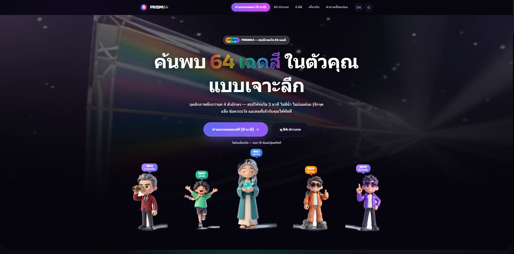
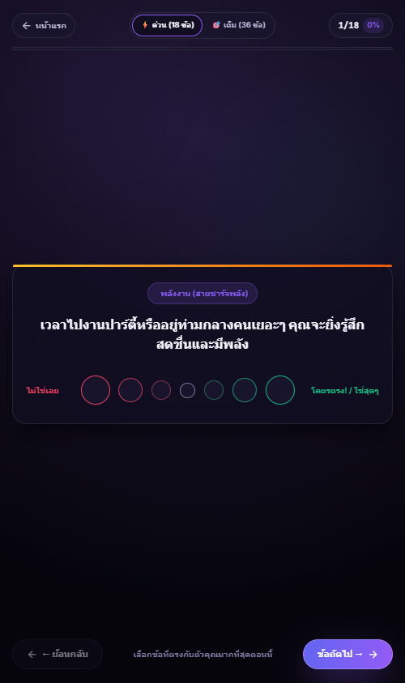
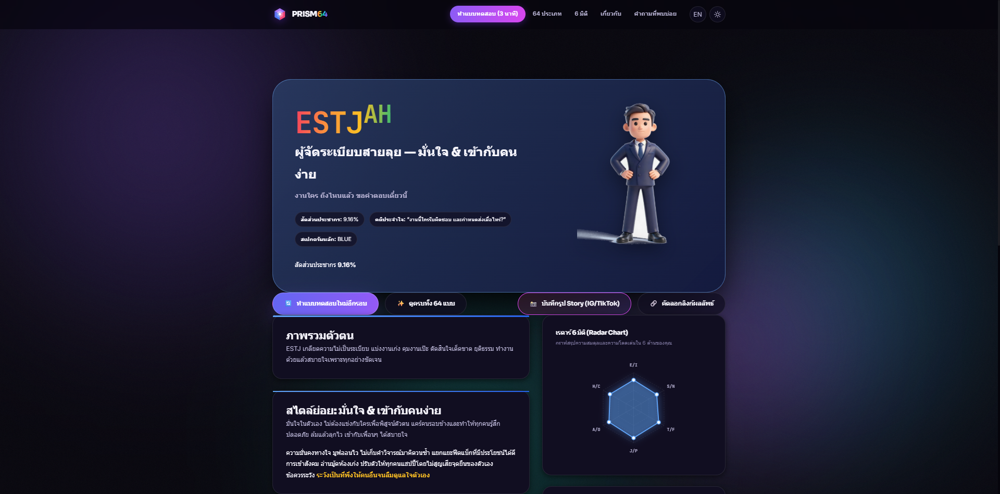
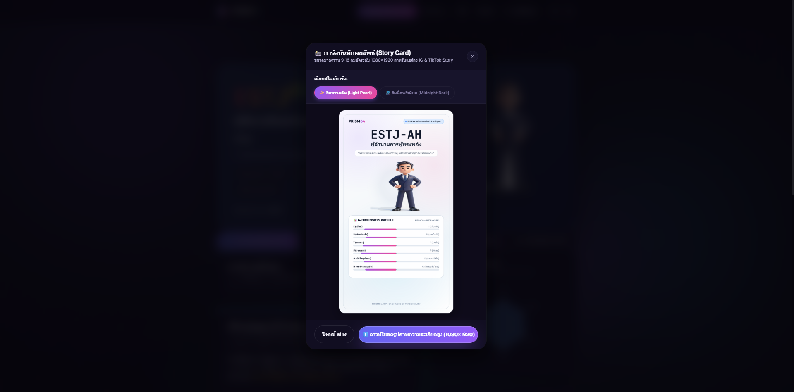
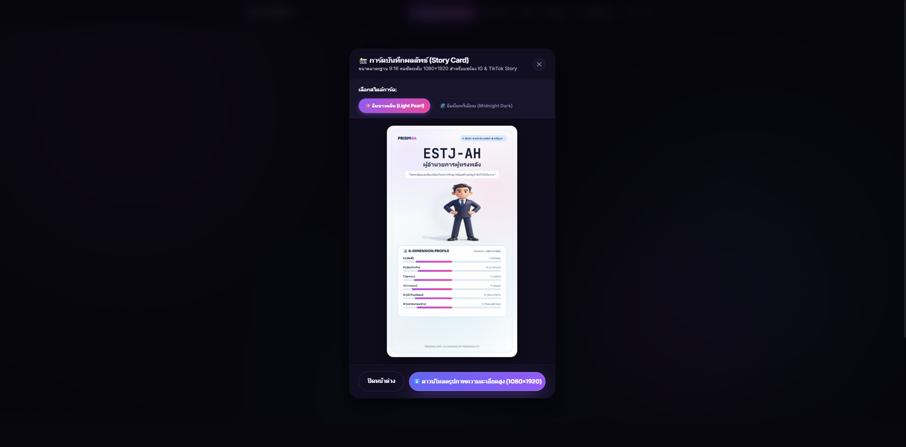

# 🔮 PRISM64 — 64 Shades of Personality Intelligence

<p align="center">
  
</p>

<p align="center">
  <a href="https://github.com/Gubbitkeytoday/prism64"></a>
  <a href="https://render.com"></a>
  <a href="https://ai.google.dev"></a>
  <a href="LICENSE"></a>
</p>

---

## 📸 Visual Showcase & Portfolio Gallery

### 🌟 Interactive Web Application & Visual Engineering

| 1. Landing Page & 3D Hero | 2. HEXACO 6-Dimension Quiz |
| :---: | :---: |
|  |  |
| *Cyberpunk glassmorphism landing with 3D Motion Hero* | *Adaptive 5-level Likert scale psychological assessment* |

| 3. In-Depth Personality Result | 4. 9:16 Social Story Studio (IG/TikTok) |
| :---: | :---: |
|  |  |
| *3D Character Podium, Spider Radar & Bento 6-Dimension profile* | *High-density 1080×1920 Story Card generator (Light Pearl & Dark)* |

| 5. Stealth Admin Dashboard & Live Geo Map | 6. 3D Motion Visual Showcase |
| :---: | :---: |
|  | [](portfolio_showcase/06_PRISM64_Motion_Hero_Showcase.mp4) |
| *Real-time GPS/IP Telemetry on dark Leaflet.js map* | *[▶️ Watch 3D Prism Motion Video (MP4)](portfolio_showcase/06_PRISM64_Motion_Hero_Showcase.mp4)* |

---

## 📖 Overview

**PRISM64** is an enterprise-grade, psychologically grounded personality intelligence engine that expands beyond traditional 4-letter Myers-Briggs (MBTI) archetypes into a rich **6-Dimensional, 64-Shade Matrix** (16 Core Archetypes × 4 Sub-Variants: **AH, AC, OH, OC**).

Built on top of empirical **HEXACO Psychological Research**, PRISM64 offers:
- ⚡ **Dual Assessment Modes**: 1.5-min Quick (18 Questions) & 3.0-min Deep (36 Questions)
- 🎨 **Ultra-Luxury 9:16 Story Card Studio**: Instant export for Instagram & TikTok Stories (Light Pearl & Midnight Dark)
- 🗺️ **Live Geo Telemetry & Stealth Admin Dashboard**: Real-time visitor map with dark-mode Leaflet.js
- 🤖 **Gemini Spark Model Context Protocol (MCP) Server**: Full JSON-RPC 2.0 AI agent integration

---

## 🏛️ Psychological Architecture (HEXACO × MBTI)

PRISM64 evaluates human behavior across 6 independent bipolar spectrums:

| Dimension | Pole 1 (Score ≥ 50) | Pole 2 (Score < 50) | Psychological Foundation |
| :--- | :--- | :--- | :--- |
| **1. Energy Direction** | **E** (Extraversion / เปิดตี้) | **I** (Introversion / เก็บพลัง) | Social engagement & energy restoration |
| **2. Information Input** | **S** (Sensing / ข้อเท็จจริง) | **N** (Intuition / ภาพในหัว) | Data perception & abstract synthesis |
| **3. Decision Making** | **T** (Thinking / ตรรกะ) | **F** (Feeling / แคร์ใจ) | Rational calculation vs value alignment |
| **4. Action Structure** | **J** (Judging / วางแผน) | **P** (Perceiving / ด้นสด) | Structured execution vs adaptive agility |
| **5. Emotional Identity** | **A** (Assertive / มูฟออนไว) | **O** (Oscillating / ใส่ใจลึกซึ้ง) | Emotional resilience & sensitivity |
| **6. Social Relating** | **H** (Harmony / เชื่อมไมตรี) | **C** (Calm-Reserved / รักสงบ) | Empathy & interpersonal harmony |

---

## 🚀 Quickstart & Local Development

### Prerequisites
- Python 3.9+ (No third-party packages required — uses standard library)
- Web Browser (Chrome, Safari, Firefox, Edge)

### Run Locally
```bash
# 1. Clone the repository
git clone https://github.com/Gubbitkeytoday/prism64.git
cd prism64

# 2. Start the multi-threaded HTTP & MCP server
python server_mcp.py 8000

# 3. Open in browser
open http://localhost:8000
```

---

## ☁️ 1-Click Deployment to Render.com (24/7 Online)

PRISM64 is pre-configured for zero-friction deployment on [Render.com](https://render.com):

1. Push your repository to **GitHub**.
2. Log in to [Render.com](https://render.com) and click **"New + > Web Service"**.
3. Select your `prism64` repository.
4. Settings:
   - **Environment:** `Python 3`
   - **Start Command:** `python server_mcp.py`
   - **Instance Type:** `Free`
5. Click **"Deploy Web Service"** — your live site will be ready at `https://prism64.onrender.com`!

---

## 🤖 Gemini Spark MCP (Model Context Protocol)

PRISM64 implements the official **Model Context Protocol (MCP)** specification over JSON-RPC 2.0. AI agents (such as Google Gemini, Claude, Cursor) can query personality archetypes directly:

### Available MCP Tools:
- `get_64_personality_profile`: Retrieve comprehensive profiles, strengths, growth points, and careers.
- `search_personality_types`: Filter archetypes by keyword, spectrum, or sub-variant.
- `calculate_hexaco_prism_scores`: Calculate archetype scores dynamically from raw dimensions.
- `analyze_compatibility`: Generate psychological compatibility analysis between two types.
- `list_all_64_archetypes`: Catalog retrieval organized by spectra.

### JSON-RPC 2.0 Endpoint:
```http
POST /mcp
Content-Type: application/json

{
  "jsonrpc": "2.0",
  "id": 1,
  "method": "tools/call",
  "params": {
    "name": "get_64_personality_profile",
    "arguments": { "typeCode": "INTJ-AH", "lang": "th" }
  }
}
```

---

## 🔒 Stealth Admin Portal & Telemetry

PRISM64 includes a hidden administrative dashboard for tracking live traffic, submissions, and geo-coordinates:
- **Secret Hash Route:** `#prism-admin-gate`
- **Master Admin PIN:** `646464`
- **Secret Keyboard Shortcut:** `Ctrl + Shift + A` (or `Cmd + Shift + A`)

---

## 📁 Repository Structure

```
prism64/
├── assets/
│   ├── css/
│   │   └── style.css            # Cyberpunk midnight & light glass design system
│   ├── js/
│   │   ├── data-core.js        # 64 archetypes, HEXACO questions & scores
│   │   ├── i18n.js             # Thai / English internationalization
│   │   ├── main.js             # Reactive router, test engine & canvas studio
│   │   └── admin.js            # Stealth admin dashboard & Leaflet live map
│   └── img/
│       ├── characters/         # 16 3D rendered character models
│       └── careers/            # 25+ 3D isometric clay diorama visuals
├── portfolio_showcase/          # High-resolution portfolio showcase gallery & video
│   ├── 01_Landing_Hero_Showcase.png
│   ├── 02_HEXACO_Assessment_Test.png
│   ├── 03_Personality_Result_ESTJ_AH.png
│   ├── 04_Story_Card_Studio_Modal.png
│   ├── 05_Live_GeoMap_Admin_Dashboard.png
│   └── 06_PRISM64_Motion_Hero_Showcase.mp4
├── data/
│   ├── submissions.json        # Persistent assessment telemetry store
│   └── visitors.json           # Live visitor session cache
├── Dockerfile                  # Production container definition
├── docker-compose.yml          # Container orchestration
├── render.yaml                 # 1-Click Render blueprint config
├── Procfile                    # Process execution file
├── server_mcp.py               # Multi-threaded HTTP & JSON-RPC MCP server
├── LICENSE                     # MIT License
└── README.md                   # Project documentation & visual showcase
```

---

## 📄 License

This project is open-source and available under the [MIT License](LICENSE).
