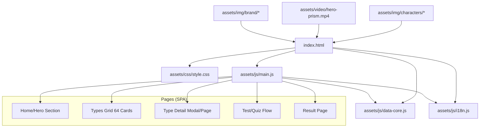

# PRISM64 — แผนพัฒนาเว็บไซต์ (Development Plan)

## ภาพรวมสถาปัตยกรรม (Architecture Overview)



## โครงสร้างไฟล์ที่จะสร้าง/ปรับปรุง

```
prism64/
├── index.html                    # [NEW] หน้าเว็บหลัก SPA
├── plans/
│   └── plan.md                   # [NEW] แผนงานนี้
├── assets/
│   ├── css/
│   │   └── style.css             # [EXISTING] ไม่ต้องแก้
│   ├── js/
│   │   ├── data-core.js          # [EXISTING] ไม่ต้องแก้
│   │   ├── i18n.js               # [NEW] ระบบภาษาไทย/อังกฤษ
│   │   └── main.js               # [NEW] ตัว render และ logic หลัก
│   ├── img/
│   │   ├── brand/                # [EXISTING]
│   │   ├── characters/           # [EXISTING] 16 ตัวละคร
│   │   └── illustrations/        # [NEW] SVG/CSS illustrations
│   └── video/
│       └── hero-prism.*          # [EXISTING]
```

## แผนงาน Todo (เรียงตามลำดับ)

### Phase 1: Foundation (พื้นฐาน)
1. **สร้าง `index.html`** — SPA structure, header, footer, sections layout
2. **สร้าง `assets/js/i18n.js`** — ระบบสลับภาษาไทย/อังกฤษ (localStorage + data attributes)
3. **สร้าง `assets/js/main.js`** — App entry, router, event handlers

### Phase 2: Core UI Components
4. **Hero Section** — Video background, title, CTA, character lineup (cast)
5. **Stats Bar** — ตัวเลขสถิติ (64 types, 6 dimensions, etc.)
6. **6 Dimensions Section** — Cards อธิบาย 6 มิติบุคลิกภาพ
7. **4 Spectra Section** — Spectrum families (Violet, Green, Blue, Amber)
8. **64 Types Grid** — Grid แสดงทั้ง 64 ประเภทพร้อมรูปตัวละคร
9. **FAQ Section** — คำถามที่พบบ่อย
10. **CTA Band** — Call to action section
11. **Footer** — Site footer with links

### Phase 3: Interactive Features
12. **Type Detail Modal** — Modal แสดงรายละเอียดแต่ละประเภท (overview, strengths, growth, careers, etc.)
13. **Type Filter/Sort** — กรองตาม spectrum, dimension, search
14. **Language Switcher** — ปุ่มสลับภาษาไทย/อังกฤษ พร้อม animation
15. **Dark/Light Mode Toggle** — ใช้ data-theme attribute

### Phase 4: Advanced Motion & Visuals
16. **SVG/CSS Illustrations** — Prism beam, spectrum wave, type badges
17. **Scroll Animations** — data-reveal, parallax, float effects
18. **Hero Video Optimization** — Lazy loading, poster fallback
19. **Micro-interactions** — Hover effects, click ripples, smooth transitions

### Phase 5: Polish & Performance
20. **Responsive Testing** — Mobile, tablet, desktop
21. **Performance Optimization** — Image lazy loading, code splitting
22. **Accessibility** — ARIA labels, keyboard navigation, screen reader support
23. **SEO** — Meta tags, Open Graph, structured data

## Design System Overview

### Color Palette (Prism Spectrum)
```
Crimson → Orange → Amber → Emerald → Teal → Azure → Indigo → Violet → Fuchsia
```

### Typography
- **Display:** Sora (TH: Anuphan/Noto Sans Thai)
- **Body:** Inter (TH: IBM Plex Sans Thai/Noto Sans Thai)
- **Mono:** JetBrains Mono

### Key Visual Effects
- Aurora blobs (animated gradient orbs)
- Film grain overlay
- Glass morphism cards
- Prism gradient text
- Spectrum gradient rules
- Floating/bob animations
- Reveal on scroll

## Component Tree

```
App
├── SkipLink
├── SiteHeader
│   ├── Brand (logo + name)
│   ├── Nav (links)
│   ├── LanguageSwitcher (TH/EN)
│   └── ThemeToggle (light/dark)
├── Main
│   ├── HeroSection
│   │   ├── VideoBackground
│   │   ├── Kicker
│   │   ├── Title (gradient text)
│   │   ├── Subtitle
│   │   ├── CTA Buttons
│   │   └── CharacterCast (5 figures)
│   ├── StatsSection
│   │   └── StatsGrid (4 stats)
│   ├── DimensionsSection
│   │   └── DimensionCards (6 cards)
│   ├── SpectraSection
│   │   └── SpectraGrid (4 spectra)
│   ├── TypesSection
│   │   ├── FilterBar (spectrum chips)
│   │   ├── SearchField
│   │   └── TypeGrid (64 cards)
│   ├── FAQSection
│   │   └── AccordionList
│   └── CTABand
├── TypeDetailModal
│   ├── VerdictHeader
│   ├── Overview
│   ├── Strengths & Growth
│   ├── Careers
│   ├── Work Style
│   ├── Love & Stress
│   └── Matches
├── SiteFooter
│   ├── FooterGrid
│   └── FooterBase
└── Atmosphere (background effects)
    ├── AuroraBlobs
    └── GrainOverlay
```

## Data Flow

```
data-core.js (DIMENSIONS, SPECTRA, CORE_TYPES, VARIANTS, ALL_CODES)
    ↓
i18n.js (translate function, language state)
    ↓
main.js (render functions, event handlers)
    ↓
index.html (DOM elements with data attributes)
```

## Language Switching Strategy

```javascript
// i18n.js
const LANG = {
    current: 'th', // or 'en'
    set(lang) { ... },
    t(key) { ... } // translate function
};

// Usage in HTML
// <h1 data-i18n="hero.title">...</h1>
// <span data-i18n="types.INTJ.name">...</span>
```

## 64 Types Generation

16 core types × 4 variants = 64 types:
```
INTJ-AH, INTJ-AC, INTJ-OH, INTJ-OC
INTP-AH, INTP-AC, INTP-OH, INTP-OC
... (for all 16 types)
```

## Image Assets Strategy

| Asset | Format | Usage |
|-------|--------|-------|
| Character PNG | PNG-24 | Full quality source |
| Character WebP | WebP Q88 | Production display |
| Character thumb | WebP Q55 | Blur-up placeholder |
| Hero video | MP4 + WebM | Background hero |
| Hero poster | JPEG | Video fallback |
| Brand spheres | WebP | Decorative |
| SVG illustrations | SVG | Icons, badges, decorations |